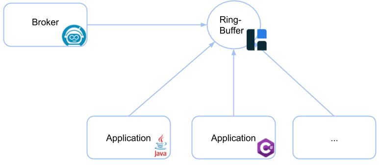

[](https://travis-ci.org/zeebe-io/zeebe-hazelcast-exporter)

# zeebe-hazelcast-exporter

Export records from [Zeebe](https://github.com/zeebe-io/zeebe) to [Hazelcast](https://github.com/hazelcast/hazelcast/). Hazelcast is an in-memory data grid which is used as a transport layer.



The records are transformed into [Protobuf](https://github.com/zeebe-io/zeebe-exporter-protobuf) and added to one [ringbuffer](https://hazelcast.com/blog/ringbuffer-data-structure/). The ringbuffer has a fixed capacity and will override the oldest entries when the capacity is reached.

Multiple applications can read from the ringbuffer. The application itself controls where to read from by proving a sequence number. Every application can read from a different sequence. 

The Java and C# connector modules provide a convenient way to read the records from the ringbuffer.

## Usage

### Java Application

Add the Maven dependency to your `pom.xml`

```
<dependency>
	<groupId>io.zeebe.hazelcast</groupId>
	<artifactId>zeebe-hazelcast-connector</artifactId>
	<version>%{VERSION}</version>
</dependency>
```

Connect to Hazelcast and register a listener 

```java
ClientConfig clientConfig = new ClientConfig();
clientConfig.getNetworkConfig().addAddress("127.0.0.1:5701");
HazelcastInstance hz = HazelcastClient.newHazelcastClient(clientConfig);

final ZeebeHazelcast zeebeHazelcast = ZeebeHazelcast.newBuilder(hz)
    .addWorkflowInstanceListener(workflowInstance -> { ... })
    .readFrom(sequence) / .readFromHead() / .readFromTail()
    .build();

// ...

long sequence = zeebeHazelcast.getSequence();

zeebeHazelcast.close();
```

### C# Application

Add the nuget package `zeebe hazelcast connector(???)` to your project.

Example usage:
```csharp
    // Start the Hazelcast Client and connect to an already running Hazelcast Cluster on 127.0.0.1
    var hz = HazelcastClient.NewHazelcastClient();
    // Get a Topic called "zeebe-deployments"
    var topic = hz.GetTopic<byte[]>("zeebe-deployments");

     // Add a Listener to the Topic
    DeploymentListener.Consumer consumer = (record) => Console.WriteLine(record.ToString());
    topic.AddMessageListener(new DeploymentListener(consumer));

```

## Install

Before you start the broker, copy the exporter JAR  into the lib folder of the broker.

```
cp exporter/target/zeebe-hazelcast-exporter-%{VERSION}-jar-with-dependencies.jar ~/zeebe-broker-%{VERSION}/lib/
```

Register the exporter in the Zeebe configuration file `~/zeebe-broker-%{VERSION}/config/zeebe.cfg.toml`.

```
[[exporters]]
id = "hazelcast"
className = "io.zeebe.hazelcast.exporter.HazelcastExporter"
```

Now start the broker and the applications.

### Configuration

In the Zeebe configuration file, you can change 

* the Hazelcast port
* the value and record types which are exported
* the ringbuffer's name
* the ringbuffer's capacity
* the ringbuffer's time-to-live

Default values:

```
[[exporters]]
id = "hazelcast"
className = "io.zeebe.hazelcast.exporter.HazelcastExporter"

    [exporters.args]
    # Hazelcast port
    port = 5701
    
    # comma separated list of io.zeebe.protocol.record.ValueType
    enabledValueTypes = "JOB,WORKFLOW_INSTANCE,DEPLOYMENT,INCIDENT"
    
    # comma separated list of io.zeebe.protocol.record.RecordType
    enabledRecordTypes = "EVENT"
        
    # Hazelcast ringbuffer's name
    name = "zeebe"
    
    # Hazelcast ringbuffer's capacity
    capacity = 10000 

    # Hazelcast ringbuffer's time-to-live in seconds
    timeToLiveInSeconds = 3600
```

## Build it from Source

The exporter and the Java connector can be built with Maven

`mvn clean install`

## Code of Conduct

This project adheres to the Contributor Covenant [Code of
Conduct](/CODE_OF_CONDUCT.md). By participating, you are expected to uphold
this code. Please report unacceptable behavior to
code-of-conduct@zeebe.io.
